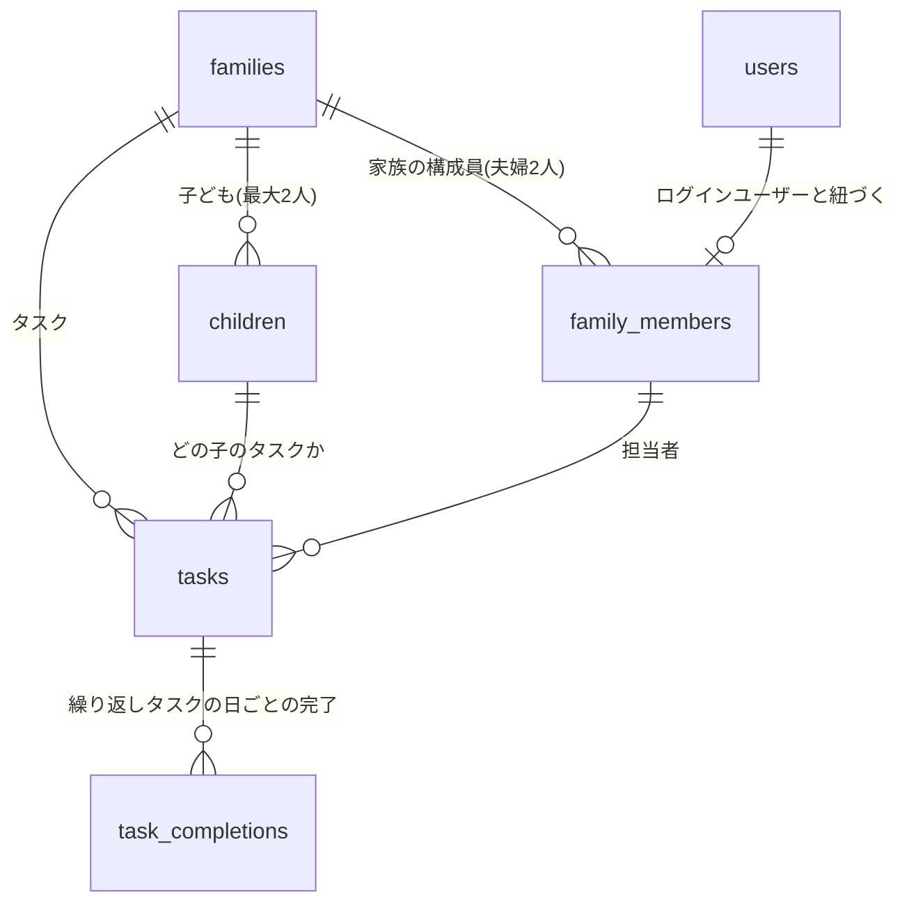

# 家族カレンダー化 設計提案

すくすく手帳の「予定」タブを、**出産・育児の手続きチェックリスト**から
**家族の日常を回すカレンダー**へ拡張するための設計案。

対象: `tasks` テーブル / `ScheduleTab` / `HomeTab` / `AddTaskModal`
ステータス: 提案（実装前）／方針確定済み

---

## 0. 確定した方針

議論を経て、以下を確定事項とする。本文はこの前提で書かれている。

| # | 論点 | 決定 |
| --- | --- | --- |
| 1 | 予定の種類分け | **しない。すべて「タスク」として扱う**（イベント/ルーティンという区分は設けない） |
| 2 | タスクの分類軸 | **「出生日から計算するもの」「日付を直接指定するもの」の2種類のみ** |
| 3 | 繰り返し | **タスクの任意設定として持たせる**（区分ではなく属性。例: ゴミ出し = 毎週火・金） |
| 4 | 家族メンバー | **夫婦2人**。ただし後々子どもを追加する可能性を残す |
| 5 | 子どもの人数 | **通常1人、最大2人** |
| 6 | Googleカレンダー連携 | **なし**（併用しない） |
| 7 | 通知 | **実装する** |
| 8 | 家事分担の集計 | **不要** |

### この決定による設計上の帰結

- **`kind` カラム（event/task/routine）は作らない。** 分類は `anchor_type` の2値のみ。
- **テーブル改名は行わない。** 当初 `tasks` → `schedule_items` への改名を提案していたが、
  その理由は「イベントを含むのに `tasks` という名前が不正確」というものだった。
  種類分けをやめた結果 **`tasks` という名前が実態と一致した**ため、改名は不要。
- **健診や運動会にも完了チェックが付く。** 種類分けをやめたことの帰結。
  「行った/済んだ」を消し込む運用になるだけで実害はなく、UI・スキーマが大幅に単純になる利得の方が大きい。
- **`task_completions` から「誰がやったか」を落とす。** 家事分担の集計が不要なため。
- **Google連携（旧Phase 4）は計画から削除。**

---

## 1. 結論（先に3行）

1. **日付の正を「生後◯日」から「絶対日付」へ移す。** 生後◯日は捨てず、`anchor_type = 'birth_relative'` として
   「出生日が確定したら絶対日付に焼き直す下書き」の位置づけにする。
2. **繰り返しをタスクの任意属性として追加する。** ゴミ出し・保育園の送迎といった日常タスクは、
   現在の構造では**1行たりとも表現できない**。ここが家族運用の最大の壁。
3. **担当者を文字列 `'パパ'/'ママ'` から `family_members` への参照に変える。** 色分けと「自分の予定」絞り込みの土台。

実装は **Phase 0（既存バグの解消）→ Phase 1（基盤）→ Phase 2（繰り返し）→ Phase 3（通知）**。
Phase 2 まで到達すれば「家族カレンダーとして運用できる」状態になる。

---

## 2. 現状の棚卸し

### 今できていること

| 機能 | 実装状況 |
| --- | --- |
| 予定の追加・編集・削除・完了 | Supabase連携済み (`src/lib/api/tasks.ts`) |
| 家族単位の共有 | `family_id` + RLS で担保済み |
| リスト表示 / 月カレンダー表示の切替 | `ScheduleTab.tsx` |
| 担当者フィルタ | パパ/ママ/二人で/未定 の4択 |
| 家族作成時の定番ToDo自動投入 | `seedDefaultTasks()` |

土台（認証・家族分離・RLS・CRUD・楽観的更新）は素直に作られていて、
**この上に載せる形で拡張できる**。作り直しは不要。

### 構造的にできないこと

現在の `tasks` テーブルの日付に関わるカラムは、実質これだけ:

```sql
days_after_birth integer not null default 0,  -- 出生日からの日数
timing_memo      text                         -- 「出生後2週間以内」等の自由文
```

日付は保存されておらず、表示のたびに `子の誕生日 + days_after_birth` で計算している
（`SukusukuApp.tsx` の `dynamicTodos`）。この構造から、以下が導かれる:

| # | できないこと | 家族運用での具体例 |
| --- | --- | --- |
| **A** | **出生日と無関係な日付を持てない** | 保育園の運動会（10/12）、パパの出張（11/5-11/7）、家賃の引き落とし日 |
| **B** | **繰り返しを表現できない** | 燃えるゴミ（毎週火・金）、保育園の送り（平日毎朝）、習い事（隔週土曜） |
| **C** | **時刻を持てない** | 「10:00 健診」「18:30 お迎え」— 1日に複数予定があると順序すら出ない |
| **D** | **期間（複数日）を持てない** | 帰省（12/28-1/3）、出張、入院 |
| **E** | **担当者を家族の実体に紐づけられない** | 担当者ごとの色分け、将来の子ども追加 |
| **F** | **子どもが2人になると破綻する** | `children` テーブルはあるが `tasks` から参照していない。「どの子の健診か」が持てない |
| **G** | **通知が飛ばない** | `has_notification` は真偽値が保存されるだけで、配信の仕組みがない |

さらに**現時点の実バグ**として:

- **子の誕生日がSupabaseに保存されていない** (`SukusukuApp.tsx` L100, `INITIAL_PROFILE` のダミー固定)。
  日付の計算元がダミーなので、**カレンダーに出ている日付は今すべて架空**。リロードで消える。
- `today = new Date()` を毎レンダー生成しており、`useMemo` の依存から意図的に外している
  (`eslint-disable-next-line react-hooks/exhaustive-deps`)。日付境界の扱いが曖昧。

> A〜D は「日常のタスクを入れる」時点で即座にぶつかる。
> つまり**カラムを足すだけでは済まず、日付モデルそのものの変更が必要**。

---

## 3. 設計方針: タスクを2種類に分ける

すべての予定を**1つの「タスク」**として扱い、分類軸は**日付の決まり方だけ**にする。

| 種類 | `anchor_type` | 日付の決まり方 | 例 |
| --- | --- | --- | --- |
| **出生日基準タスク** | `birth_relative` | `子の誕生日 + days_after_birth` | 出生届、児童手当申請、1ヶ月健診、予防接種① |
| **日付指定タスク** | `absolute` | `start_date` を直接指定 | 運動会、出張、ゴミ出し、保育園おむかえ |

**繰り返しは種類ではなく、どのタスクにも付けられる任意設定**とする。

```
タスク
├─ 日付の決まり方        … 出生日基準 / 日付指定   ← 2種類の分類軸
├─ 繰り返し（任意）      … なし / 毎日 / 毎週 / 毎月 / 毎年
├─ 時刻（任意）          … 終日 / 時刻あり
├─ 終了日（任意）        … 複数日にまたがる場合
└─ 担当（任意）          … パパ / ママ / 二人で / 未定
```

### 繰り返しタスクの完了だけは、別の持ち方が要る

ここが設計上の唯一の急所。

「毎週火曜のゴミ出し」は**ルールとしては1行**だが、完了は 10/7・10/14・10/21… と
**発生日ごとに立つ**。これを既存の `is_done boolean` で持とうとすると、
一度チェックした瞬間に「ゴミ出し」が永久に完了扱いになり破綻する。

したがって:

- **単発タスク** → 既存の `is_done boolean` をそのまま使う
- **繰り返しタスク** → `task_completions` テーブルに**日付ごとに1行**積む

繰り返しを設定しない限りこのテーブルは一切使われないため、
単発タスクだけを使う分には現状と同じ複雑さに留まる。

---

## 4. データモデル案



### 4.1 `family_members` — 家族の構成員（新設）

担当者を文字列から実体へ。**色分けと「自分の予定」フィルタの土台**になる。

```sql
create table public.family_members (
  id           uuid primary key default gen_random_uuid(),
  family_id    uuid not null references public.families(id) on delete cascade,
  user_id      uuid references public.users(id) on delete set null,     -- ログインする人だけ
  child_id     uuid references public.children(id) on delete cascade,   -- 将来子どもを足す場合
  display_name text not null,                                           -- 'パパ' 'ママ'
  color        text not null default 'blue',                            -- UIの配色キー
  sort_order   smallint not null default 0,
  created_at   timestamptz not null default now()
);

create index idx_family_members_family_id on public.family_members (family_id);
```

設計上のポイント:

- **当面は夫婦2人ぶんの行しか作らない。** 家族作成時・パートナー参加時に自動生成し、
  **メンバー管理画面は作らない**（Phase 1 では画面上は透明な存在）。
- **`user_id` / `child_id` はどちらも nullable。** 「後々子どもを入れるかも」に対しては、
  `child_id` を埋めた行を1つ足すだけで対応できる。
  テーブル1つと自動生成2行のコストで、後からのデータ移行を丸ごと回避できるため、今入れておく。
- **既存の `children` は残す。** 成長記録（`growth_records`）が子ども固有の属性として
  `children` にぶら下がっているため。`family_members.child_id` で橋渡しする。
- **「二人で」は担当者なし + `is_family_wide = true`** で表現する（後述）。

### 4.2 `tasks` — 既存テーブルの拡張

> **改名はしない。** 種類分けをやめた結果、`tasks` という名前が実態と一致したため。

```sql
alter table public.tasks
  -- 日付 / 時刻 ------------------------------------------------------
  add column start_date date,          -- 正となる日付
  add column start_time time,          -- null なら終日
  add column end_date   date,          -- 複数日にまたがる場合（任意）
  add column end_time   time,

  -- 分類軸: 出生日基準 or 日付指定 --------------------------------------
  add column anchor_type text not null default 'absolute'
    check (anchor_type in ('birth_relative', 'absolute')),
  -- days_after_birth は既存カラムをそのまま流用（birth_relative のときのみ意味を持つ）
  add column child_id uuid references public.children(id) on delete set null,

  -- 担当 -------------------------------------------------------------
  add column assignee_member_id uuid references public.family_members(id) on delete set null,
  add column is_family_wide boolean not null default false,   -- 「二人で」

  -- 繰り返し（任意設定） -----------------------------------------------
  add column repeat_freq text
    check (repeat_freq in ('daily', 'weekly', 'monthly', 'yearly')),
  add column repeat_interval  smallint not null default 1,  -- 2 = 隔週
  add column repeat_weekdays  smallint[],                   -- 0=日..6=土, weekly のとき [2,5]
  add column repeat_month_day smallint,                     -- monthly のとき 25
  add column repeat_until     date,

  -- 通知 -------------------------------------------------------------
  add column remind_minutes_before integer[],  -- [1440, 60] = 前日 / 1時間前
  add column created_by uuid references public.users(id) on delete set null;

-- 整合性ガード
alter table public.tasks
  add constraint tasks_needs_a_date_source
    check (start_date is not null or anchor_type = 'birth_relative'),
  add constraint tasks_weekly_requires_weekdays
    check (repeat_freq <> 'weekly' or repeat_weekdays is not null),
  add constraint tasks_birth_relative_is_not_repeating
    check (anchor_type = 'absolute' or repeat_freq is null);

create index idx_tasks_family_start on public.tasks (family_id, start_date);
create index idx_tasks_repeating on public.tasks (family_id) where repeat_freq is not null;
```

最後の制約について: **出生日基準タスクは繰り返さない**。
「生後30日から毎週」のようなものは実際には登場せず、許すと
`refresh_birth_relative_dates()` と繰り返し展開の相互作用が複雑になるだけなので、
最初から禁止しておく。

#### なぜ `timestamptz` ではなく `date` + `time` に分けるのか

終日タスクを `timestamptz` に押し込むと、**タイムゾーン起因の「1日ずれる」バグ**を必ず踏む
（Vercelのサーバーは UTC、クライアントは JST）。カレンダーは日付が命なので、ここは保守的に:

- **終日タスク** → `start_date` のみ、`start_time` は `null`
- **時刻付きタスク** → `start_date` + `start_time`

前提として**家族全員が日本国内（単一タイムゾーン）**に居ることを置いている。
海外旅行中の現地時刻の予定を正確に扱いたくなった時が、この判断の見直し時期。

#### 「生後◯日」の位置づけを変える

今の `days_after_birth` は**唯一の日付ソース**だが、これを**出生日基準タスク専用の入力値**に限定する。

- 出産前 / 出生日未確定のうちは `anchor_type = 'birth_relative'` で「生後14日」として持つ
- **出生日が確定した時点で、絶対日付 `start_date` に焼き付ける**

```sql
create or replace function public.refresh_birth_relative_dates(p_family_id uuid)
returns void language sql security invoker as $$
  update public.tasks t
     set start_date = c.birth_date + t.days_after_birth
    from public.children c
   where t.family_id   = p_family_id
     and t.child_id    = c.id
     and t.anchor_type = 'birth_relative'
     and c.birth_date is not null;
$$;
```

こうすると:
- **予定日がずれても定番ToDoが一括で追随する**（現行設計の唯一かつ本物の長所を維持）
- 一方で **`start_date` が常に埋まっているので、日付範囲のSQL検索・インデックスが効く**

現行の「毎回クライアントで再計算」方式は、月表示で全件取得が必要になり、
予定が数百件を超えると素直に重くなる。ここは早めに変えておく価値がある。

### 4.3 `task_completions` — 繰り返しタスクの日ごとの完了（新設）

```sql
create table public.task_completions (
  id           uuid primary key default gen_random_uuid(),
  task_id      uuid not null references public.tasks(id) on delete cascade,
  family_id    uuid not null references public.families(id) on delete cascade,
  target_date  date not null,
  status       text not null default 'done'
                 check (status in ('done', 'skipped')),
  completed_at timestamptz not null default now(),
  unique (task_id, target_date)
);

create index idx_task_completions_family_date
  on public.task_completions (family_id, target_date);
```

- **ルール本体は `tasks` の1行のまま、完了だけが日ごとに積まれる。**
- `status = 'skipped'` で「今週は祝日でゴミ収集なし」を表現できる。
- `family_id` を非正規化して持たせているのは、**RLSポリシーを他テーブルと同じ形に揃えるため**
  （`task_id` 経由の `exists` サブクエリだと、`growth_records` と同じく評価コストが乗る）。
- **「誰がやったか」は保存しない**（家事分担の集計が不要のため）。
  必要になったら `completed_by_member_id` を1カラム足すだけで後付けできる。

### 4.4 繰り返しをどう表現するか（3案の比較）

| 案 | 内容 | 評価 |
| --- | --- | --- |
| **RRULE (RFC 5545) 文字列** | `FREQ=WEEKLY;BYDAY=TU,FR` を保存し、`rrule` npm で展開 | 標準準拠だが依存が増え、例外日の扱いが煩雑。Googleカレンダー連携をしない以上、標準準拠の利点がない |
| **構造化カラム（推奨）** | `repeat_freq` / `repeat_weekdays` 等をカラムで持つ | 実装が軽くUIも素直。家庭用途の95%をカバー |
| **事前に実体行を生成** | 1年分の行を先に作っておく | 単純だが行数が爆発し、ルール変更時の再生成が地獄 |

**構造化カラム方式を推奨。** 展開は**表示範囲（その月/その週）に対してのみクライアント側で行う**
（`src/lib/recurrence.ts` に切り出す）。

月表示のクエリは3本に収まる:

```
1. 単発:     repeat_freq is null かつ start_date が [月初, 月末] に入る行
2. 繰り返し: repeat_freq is not null かつ start_date <= 月末
             かつ (repeat_until is null or repeat_until >= 月初)  → クライアントで展開
3. 完了状況: target_date が [月初, 月末] に入る task_completions
```

### 4.5 RLS

既存と同じパターンをそのまま踏襲する（`current_family_id()` ヘルパーが既にある）。

```sql
alter table public.family_members   enable row level security;
alter table public.task_completions enable row level security;

create policy "family_members_family_all" on public.family_members
  for all using (family_id = public.current_family_id())
  with check (family_id = public.current_family_id());

create policy "task_completions_family_all" on public.task_completions
  for all using (family_id = public.current_family_id())
  with check (family_id = public.current_family_id());
```

---

## 5. 画面・UI設計案

### 5.1 タブ構成

家族カレンダーとして運用するなら、**「予定」がアプリの中心**になる。
現在の5タブは維持しつつ、ホームと予定の役割を再定義する。

| タブ | 現在 | 変更案 |
| --- | --- | --- |
| ホーム | 生後◯日カウンタ + 直近3件 | **「今日」に再構成**: 今日のタスク / 期限切れ。生後カウンタは縮小 |
| 予定 | リスト / 月カレンダー | **週表示を追加**し、月セルをタップ可能に |
| 記録・お祝い・ストック | 現状のまま | 変更なし |

### 5.2 カレンダービューの改善点

現在の月グリッド（`ScheduleTab.tsx` L163-182）に対する具体的な変更:

| 現状 | 変更案 | 理由 |
| --- | --- | --- |
| セルがタップできない | **タップで選択日を切り替え**、下部リストを選択日のタスクに連動 | 「その日に何があるか」が家族運用の基本動作 |
| ドットが青一色・最大3個 | **担当者の色**で表示、4件以上は `+2` 表記 | 誰のタスクかが一目で分かることの価値が大きい |
| 下部が「n月の予定」の羅列 | **選択日 → その日のタスク**（未選択時は今日） | 月単位の羅列は件数が増えると読めない |
| 月表示のみ | **週表示を追加**（時刻を縦軸に） | 家族運用でいちばん見るのは「今週の動き」 |
| 月移動はボタンのみ | 左右スワイプを追加 | スマホ主体のため |
| 完了/未完了の2値のみ | 繰り返しタスクは**その日の完了状態**を反映 | 「今日のゴミ出しは済んだか」が一目で分かる |

### 5.3 リストビュー

現在は `days_after_birth` 順の**フラットな1本のリスト**。日常運用には向かない。

```
▼ 期限切れ (2)        ← 赤。最上部に置く
   児童手当申請  ママ  9/1期限

▼ 今日 10/14 (火)
   07:30  ゴミ出し（燃える）      パパ   ☑
   18:30  保育園おむかえ          ママ

▼ 明日 10/15 (水)
   10:00  1ヶ月健診               二人で

▼ 今週これから
▼ 以降
```

### 5.4 追加モーダル

現在の `AddTaskModal` は「生後◯日」入力が必須級になっており、日常タスクを入れづらい。
**日付入力を主、生後◯日を従にする。**

```
┌────────────────────────────────┐
│ 新規タスク                          │
├────────────────────────────────┤
│ タイトル      [                  ]  │
│ カテゴリ      [手続き ▼]  担当 [ママ ▼] │
│                                     │
│ 日付   ◉ 日付を指定  [2026/10/14]    │
│        ○ 生後日数で指定 [  30 ]日     │  ← 出生日が未確定のときだけ表示
│                                     │
│ □ 時刻を設定      [ 07:30 ]         │
│ □ 終了日を設定    [2026/10/16]      │
│ □ 繰り返す        [毎週 ▼] [火][金]  │  ← 任意設定
│ □ 通知する        [前日 ▼]           │
│                                     │
│ 場所 / 持ち物 / メモ  …               │
└────────────────────────────────┘
```

- **「生後日数で指定」は出生日が未確定のうちだけ出す。** 確定後は日付指定に一本化する
  （既存の出生日基準タスクは `refresh_birth_relative_dates()` で絶対日付に焼き付け済みになる）。
- **繰り返し・時刻・終了日・通知はすべて折りたたみ**。既定では閉じておき、
  普段の登録が「タイトル + 日付 + 担当」の3項目で終わるようにする。

さらに、**よく使う日常タスクのワンタップ登録テンプレート**を用意する:

```
ゴミ出し / 保育園おくり / 保育園おむかえ / 沐浴 / 投薬 / 洗濯 / 買い出し
```

初期設定の摩擦が、この種のアプリが続くかどうかを決める。ここは手を抜かない方がよい。

### 5.5 型定義の変更（`src/types/app.ts`）

```ts
export type AnchorType = 'birth_relative' | 'absolute';

export interface Task {
  id: string;
  title: string;
  category: string;
  // 日付
  anchorType: AnchorType;
  startDate: string | null;      // 'YYYY-MM-DD'
  startTime: string | null;      // 'HH:mm' / null なら終日
  endDate: string | null;
  endTime: string | null;
  daysAfterBirth: number;        // anchorType='birth_relative' のときのみ意味を持つ
  childId: string | null;
  // 担当
  assigneeMemberId: string | null;
  isFamilyWide: boolean;         // 「二人で」
  // 繰り返し（任意）
  repeat: RepeatRule | null;
  // その他
  place: string;
  belongings: string;
  note: string;
  remindMinutesBefore: number[];
  done: boolean;                 // 単発タスクのみ。繰り返しは task_completions を見る
}

export interface RepeatRule {
  freq: 'daily' | 'weekly' | 'monthly' | 'yearly';
  interval: number;
  weekdays: number[] | null;     // 0=日..6=土
  monthDay: number | null;
  until: string | null;
}

// カレンダー表示用に「特定の日に展開された1件」
export interface TaskOccurrence {
  task: Task;
  date: Date;
  status: 'pending' | 'done' | 'skipped';
}
```

`Assignee` 型（`'パパ' | 'ママ' | '二人で' | '未定'`）と
`getAssigneeColor()`（`src/lib/uiUtils.ts`）は、`family_members` ベースの
`getMemberColor(member)` に置き換わる。

---

## 6. 通知（実装する）

`has_notification` は**真偽値が保存されるだけで、配信の仕組みがない**。
`remind_minutes_before integer[]`（例: `[1440, 60]` = 前日 / 1時間前）に置き換えたうえで、
配信基盤を作る。

| 手段 | 評価 |
| --- | --- |
| **Web Push (PWA)** ← 推奨 | アプリ内で完結。無料。iOSはホーム画面追加が必要な点だけ要説明 |
| メール (Resend等) | 確実だが、日々のゴミ出し通知には重く、気づきにくい |
| LINE | 到達率は最高だが Messaging API の構築コストが大きい。※LINE Notify は終了済みのため要確認 |

**推奨構成:**
```
pg_cron (5分間隔)
  → Supabase Edge Function
      → remind_minutes_before に該当するタスク（繰り返しは当日ぶんを展開）を抽出
      → Web Push 送信 → 送信済みを記録して二重送信を防ぐ
```

必要になるもの:
- `push_subscriptions` テーブル（端末ごとの購読情報。ユーザー1人が複数端末を持ち得る）
- `notification_logs` テーブル（送信済み記録。二重送信の防止に必須）
- PWA化（`manifest.json` + Service Worker）

**Phase 3 で実装する。** Phase 1-2 の間は「ホームの『今日』セクション」で代替し、
先にカレンダーとしての運用を成立させる。

---

## 7. 段階的な実装計画

### Phase 0 — 土台の修復（必須・先行）

> **カレンダーの日付の計算元がダミーデータのままなので、ここを直さないと何を作っても砂上。**

- [ ] `children` / `users` プロフィール（子の名前・誕生日、パパママ名）のSupabase永続化
- [ ] `INITIAL_PROFILE` ダミーの撤去、`InfoTab` の保存をDBへ接続
- [ ] `today` の扱いを整理（日付境界を明示的に持つ）

### Phase 1 — カレンダーの基盤

- [ ] `family_members` 新設。家族作成時・パートナー参加時に「パパ/ママ」を自動生成
- [ ] `tasks` にカラム追加（マイグレーション `0006`）※改名はしない
- [ ] 既存行の移行: `anchor_type='birth_relative'`、`start_date = birth_date + days_after_birth`、
      `assignee` 文字列 → `assignee_member_id`（「二人で」は `is_family_wide=true`）
- [ ] `refresh_birth_relative_dates()` を追加し、誕生日の保存時に呼ぶ
- [ ] `src/lib/api/tasks.ts` を新カラムに対応、型を新 `Task` へ
- [ ] 追加モーダルに**日付入力**を追加（生後◯日は出生日未確定時のみ）
- [ ] `src/types/supabase.ts` の型再生成

**この時点で「日付を指定したタスク」が入れられる = 運動会も出張も登録できる。**

### Phase 2 — 繰り返しと日常運用（家族カレンダーとして成立する地点）

- [ ] `task_completions` 新設
- [ ] 繰り返しルールの入力UI + クライアント側の展開ロジック（`src/lib/recurrence.ts`）
- [ ] 繰り返しタスクの日ごとの完了トグル
- [ ] ホームを「今日」に再構成（今日のタスク / 期限切れ）
- [ ] カレンダーの日付タップ → 日別表示、担当者カラーのドット
- [ ] 週表示の追加
- [ ] 日常タスクのワンタップ登録テンプレート

### Phase 3 — 通知

- [ ] PWA化（`manifest.json` + Service Worker）
- [ ] `push_subscriptions` / `notification_logs` の新設
- [ ] `pg_cron` + Edge Function による Web Push 配信
- [ ] 追加モーダルの通知設定UI（前日 / 当日朝 / 1時間前）

> Googleカレンダー連携は**併用しない方針のため計画から除外**。

---

## 8. リスクとトレードオフ

| リスク | 対応 |
| --- | --- |
| 健診・運動会にも完了チェックが付く | 種類分けをやめたことの帰結。「行った」を消し込む運用で実害はなく、単純さの利得が上回る |
| 繰り返しタスクの完了だけ別テーブルになり、完了判定が2経路になる | `is_done`（単発）と `task_completions`（繰り返し）を、API層の1つの関数に隠蔽して吸収する |
| 繰り返しをクライアント展開するため、長期集計がSQLで書きにくい | 家事分担の集計は不要と確定しているため、当面問題にならない |
| `assignee` 文字列 → `member_id` のデータ移行 | 既存行は `display_name` の一致で機械移行。一致しない分は「未定」に寄せる |
| 機能追加でアプリが複雑になり、かえって使われなくなる | 追加モーダルの詳細項目は既定で折りたたみ、ホームを「今日」だけに絞る。**普段は1画面で完結**させる |
| PWA化に伴う iOS の制約（ホーム画面追加が必要） | Phase 3 の着手時に、初回の案内UIをセットで作る |

---

## 付録: 想定するタスクの例

Phase 2 完了後に登録できるようになるもの:

| タスク | 分類 | 繰り返し | 時刻 | 担当 |
| --- | --- | --- | --- | --- |
| 燃えるゴミ | 日付指定 | `weekly` / `[2,5]`（火・金） | 07:30 | パパ |
| 保育園おくり | 日付指定 | `weekly` / `[1,2,3,4,5]` | 07:45 | パパ |
| 保育園おむかえ | 日付指定 | `weekly` / `[1,2,3,4,5]` | 18:00 | ママ |
| 資源ゴミ | 日付指定 | `monthly` / 第2水曜 ※下記参照 | 07:30 | パパ |
| 家賃引き落とし | 日付指定 | `monthly` / `month_day=25` | 終日 | 二人で |
| 運動会 | 日付指定 | なし | 終日 | 二人で |
| 帰省 | 日付指定 | なし | 終日 / `end_date` あり | 二人で |
| 児童手当申請 | **出生日基準** | なし（禁止） | 終日 | パパ |
| 1ヶ月健診 | **出生日基準** | なし（禁止） | 10:00 | 二人で |
| 予防接種① | **出生日基準** | なし（禁止） | 終日 | 未定 |

> **「第2水曜」は現在の `repeat_month_day`（日付指定）では表現できない。**
> 資源ゴミなど日本の自治体でよくあるパターンなので、Phase 2 で
> `repeat_month_week smallint`（第n週）の追加を併せて検討する。
