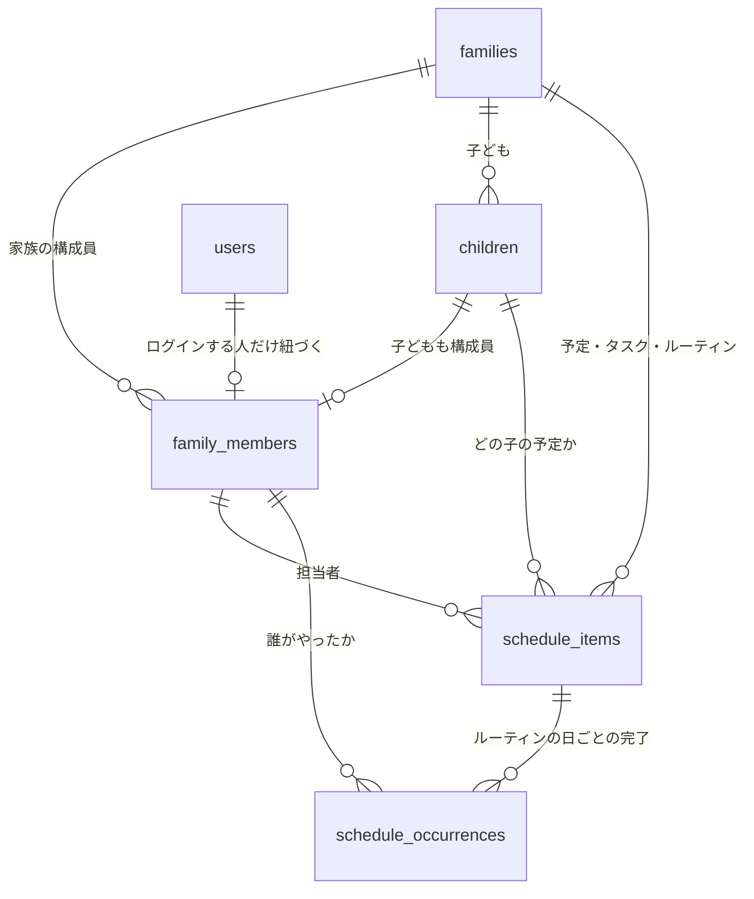

# 家族カレンダー化 設計提案

すくすく手帳の「予定」タブを、**出産・育児の手続きチェックリスト**から
**家族の日常を回すカレンダー**へ拡張するための設計案。

対象: `tasks` テーブル / `ScheduleTab` / `HomeTab` / `AddTaskModal`
ステータス: 提案（実装前）

---

## 1. 結論（先に3行）

1. **予定を「イベント / タスク / ルーティン」の3種別に分ける。** 今の `tasks` は前2つを無理に1つの形で表現しており、3つ目（毎週のゴミ出しのような繰り返し）は**構造的に表現できない**。ここが家族運用の最大の壁。
2. **日付の正を「生後◯日」から「絶対日付」へ移す。** 生後◯日は捨てず、「出生日が確定したら絶対日付に焼き直すための下書き」に降格させる。
3. **担当者を文字列 `'パパ'/'ママ'` から `family_members` への参照に変える。** 色分け・「自分の予定」絞り込み・子ども/祖父母の追加が、これ無しでは全部詰む。

実装は **Phase 0（既存バグの解消）→ Phase 1（基盤）→ Phase 2（日常タスク）** の順。
Phase 2 まで到達すれば「家族カレンダーとして運用できる」状態になる。

---

## 2. 現状の棚卸し

### 今できていること

| 機能 | 実装状況 |
| --- | --- |
| 予定の追加・編集・削除・完了 | Supabase連携済み (`src/lib/api/tasks.ts`) |
| 家族単位の共有 | `family_id` + RLS で担保済み |
| リスト表示 / 月カレンダー表示の切替 | `ScheduleTab.tsx` |
| 担当者フィルタ | パパ/ママ/二人で/未定 の4択 |
| 家族作成時の定番ToDo自動投入 | `seedDefaultTasks()` |

土台（認証・家族分離・RLS・CRUD・楽観的更新）は素直に作られていて、
**この上に載せる形で拡張できる**。作り直しは不要。

### 構造的にできないこと

現在の `tasks` テーブルの日付に関わるカラムは、実質これだけ:

```sql
days_after_birth integer not null default 0,  -- 出生日からの日数
timing_memo      text                         -- 「出生後2週間以内」等の自由文
```

日付は保存されておらず、表示のたびに `子の誕生日 + days_after_birth` で計算している
（`SukusukuApp.tsx` の `dynamicTodos`）。この構造から、以下が導かれる:

| # | できないこと | 家族運用での具体例 |
| --- | --- | --- |
| **A** | **出生日と無関係な日付を持てない** | 保育園の運動会（10/12）、パパの出張（11/5-11/7）、家賃の引き落とし日 |
| **B** | **繰り返しを表現できない** | 燃えるゴミ（毎週火・金）、保育園の送り（平日毎朝）、習い事（隔週土曜） |
| **C** | **時刻を持てない** | 「10:00 健診」「18:30 お迎え」— 1日に複数予定があると順序すら出ない |
| **D** | **期間（複数日）を持てない** | 帰省（12/28-1/3）、出張、入院 |
| **E** | **担当者を家族の実体に紐づけられない** | 子ども本人の予定、じいじが迎え、担当者ごとの色分け |
| **F** | **子どもが2人以上になると破綻する** | `children` テーブルはあるが `tasks` から参照していない。「どの子の健診か」が持てない |
| **G** | **通知が飛ばない** | `has_notification` は真偽値が保存されるだけで、配信の仕組みがない |

さらに**現時点の実バグ**として:

- **子の誕生日がSupabaseに保存されていない** (`SukusukuApp.tsx` L100, `INITIAL_PROFILE` のダミー固定)。
  日付の計算元がダミーなので、**カレンダーに出ている日付は今すべて架空**。リロードで消える。
- `today = new Date()` を毎レンダー生成しており、`useMemo` の依存から意図的に外している
  (`eslint-disable-next-line react-hooks/exhaustive-deps`)。日付境界の扱いが曖昧。

> A〜D は「日常のタスクを入れる」時点で即座にぶつかる。
> つまり**カラムを足すだけでは済まず、日付モデルそのものの変更が必要**。

---

## 3. 設計方針: 予定を3種別に分ける

家族の予定は、見た目が似ていても**振る舞いが3つに分かれる**。
これを1つの形で扱おうとすると、UIが必ず破綻する（イベントにチェックボックスが付く、
ToDoリストに健診が混ざる、等）。

| 種別 | 性質 | 完了の概念 | 例 |
| --- | --- | --- | --- |
| **イベント** `event` | 日時が決まっている。起きるか、中止になる | なし | 1ヶ月健診、運動会、出張、外食 |
| **タスク** `task` | 期限がある。誰かがやる | ある（1回） | 出生届、児童手当申請、内祝い発送 |
| **ルーティン** `routine` | 繰り返す日常 | ある（**発生日ごと**に） | ゴミ出し、保育園の送迎、投薬、沐浴 |

**ルーティンの完了が「発生日ごと」である点が設計上の急所。**
「毎週火曜のゴミ出し」は1つのルールだが、完了は 10/7・10/14・10/21… と日ごとに立つ。
ここを `is_done boolean` 1つで持とうとすると必ず行き詰まる。

### テーブル分割か、単一テーブル + 種別カラムか

**単一テーブル + `kind` カラムを推奨。**

- カレンダー表示は3種別を**時系列で1本にマージして見せる**のが本質。
  テーブルを分けると、月表示のたびに3クエリ＋クライアント側マージ＋RLSポリシー3セットになる。
- 家庭用途のデータ量（年間で数百〜数千行）では、分割によるパフォーマンス上の利点がない。
- 代償は「種別によって NULL になるカラムが増える」こと。これは `check` 制約で整合性を守れば許容範囲。

---

## 4. データモデル案



### 4.1 `family_members` — 家族の構成員（新設）

担当者を文字列から実体へ。**色分け・自分の予定フィルタ・子ども/祖父母の追加が全部ここに乗る。**

```sql
create table public.family_members (
  id           uuid primary key default gen_random_uuid(),
  family_id    uuid not null references public.families(id) on delete cascade,
  user_id      uuid references public.users(id) on delete set null,     -- ログインする人だけ
  child_id     uuid references public.children(id) on delete cascade,   -- 子どもなら紐づく
  display_name text not null,                                           -- 'パパ' 'ママ' 'そうた'
  member_type  text not null default 'other'
                 check (member_type in ('parent', 'child', 'other')),
  color        text not null default 'blue',                            -- UIの配色キー
  sort_order   smallint not null default 0,
  created_at   timestamptz not null default now()
);
```

設計上のポイント:

- **`user_id` は nullable。** 子どもや祖父母はログインしないが、予定の担当にはなる。
  「ログインユーザー」と「家族の構成員」は別概念として分ける。
- **既存の `children` は残す。** 成長記録（`growth_records`）が子ども固有の属性として
  `children` にぶら下がっているため。`family_members.child_id` で橋渡しする。
- 「二人で」は**担当者なし + `is_family_wide = true`** で表現する（後述）。
  メンバーが3人以上に増えたとき「二人で」という文字列は意味を失うため。

### 4.2 `schedule_items` — 予定の統合テーブル（`tasks` を拡張）

```sql
-- 名前が実態と合わなくなるため改名（データ量が事実上ゼロの今なら無コスト）
alter table public.tasks rename to schedule_items;

alter table public.schedule_items
  -- 種別 -------------------------------------------------------------
  add column kind text not null default 'task'
    check (kind in ('event', 'task', 'routine')),

  -- 日付 / 時刻 ------------------------------------------------------
  add column start_date date,          -- 正となる日付
  add column start_time time,          -- null なら終日
  add column end_date   date,          -- 複数日にまたがる場合
  add column end_time   time,

  -- 出生日相対アンカー（定番テンプレ用に温存） -------------------------
  add column anchor_type text not null default 'absolute'
    check (anchor_type in ('absolute', 'birth_relative')),
  -- days_after_birth は既存カラムをそのまま流用（birth_relative のときのみ意味を持つ）
  add column child_id uuid references public.children(id) on delete set null,

  -- 担当 -------------------------------------------------------------
  add column assignee_member_id uuid references public.family_members(id) on delete set null,
  add column is_family_wide boolean not null default false,

  -- 繰り返し ---------------------------------------------------------
  add column repeat_freq text
    check (repeat_freq in ('daily', 'weekly', 'monthly', 'yearly')),
  add column repeat_interval  smallint not null default 1,  -- 2 = 隔週
  add column repeat_weekdays  smallint[],                   -- 0=日..6=土, weekly のとき [2,5]
  add column repeat_month_day smallint,                     -- monthly のとき 25
  add column repeat_until     date,

  -- 通知 -------------------------------------------------------------
  add column remind_minutes_before integer[],  -- [1440, 60] = 前日 / 1時間前
  add column created_by uuid references public.users(id) on delete set null;

-- 整合性ガード
alter table public.schedule_items
  add constraint routine_requires_repeat
    check (kind <> 'routine' or repeat_freq is not null),
  add constraint needs_a_date_source
    check (start_date is not null or anchor_type = 'birth_relative'),
  add constraint weekly_requires_weekdays
    check (repeat_freq <> 'weekly' or repeat_weekdays is not null);

create index idx_schedule_items_family_start
  on public.schedule_items (family_id, start_date);
create index idx_schedule_items_repeating
  on public.schedule_items (family_id) where repeat_freq is not null;
```

#### なぜ `timestamptz` ではなく `date` + `time` に分けるのか

終日予定を `timestamptz` に押し込むと、**タイムゾーン起因の「1日ずれる」バグ**を必ず踏む
（Vercelのサーバーは UTC、クライアントは JST）。カレンダーは日付が命なので、ここは保守的に:

- **終日予定** → `start_date` のみ、`start_time` は `null`
- **時刻付き予定** → `start_date` + `start_time`

前提として**家族全員が日本国内（単一タイムゾーン）**に居ることを置いている。
海外旅行中の現地時刻の予定を正確に扱いたくなった時が、この判断の見直し時期。

#### 「生後◯日」の位置づけを変える

今の `days_after_birth` は**唯一の日付ソース**だが、これを**入力補助**に降格させる。

- 出産前 / 出生日未確定のうちは `anchor_type = 'birth_relative'` で「生後14日」として持つ
- **出生日が確定した時点で、絶対日付 `start_date` に焼き付ける**

```sql
create or replace function public.refresh_birth_relative_dates(p_family_id uuid)
returns void language sql security invoker as $$
  update public.schedule_items si
     set start_date = c.birth_date + si.days_after_birth
    from public.children c
   where si.family_id  = p_family_id
     and si.child_id   = c.id
     and si.anchor_type = 'birth_relative'
     and c.birth_date is not null;
$$;
```

こうすると:
- **予定日がずれても定番ToDoが一括で追随する**（現行設計の唯一かつ本物の長所を維持）
- 一方で **`start_date` が常に埋まっているので、日付範囲のSQL検索・インデックスが効く**

現行の「毎回クライアントで再計算」方式は、月表示で全件取得が必要になり、
予定が数百件を超えると素直に重くなる。ここは早めに変えておく価値がある。

### 4.3 `schedule_occurrences` — ルーティンの日ごとの完了（新設）

```sql
create table public.schedule_occurrences (
  id               uuid primary key default gen_random_uuid(),
  item_id          uuid not null references public.schedule_items(id) on delete cascade,
  family_id        uuid not null references public.families(id) on delete cascade,
  occurrence_date  date not null,
  status           text not null default 'done'
                     check (status in ('done', 'skipped')),
  done_by_member_id uuid references public.family_members(id) on delete set null,
  done_at          timestamptz not null default now(),
  note             text default '',
  unique (item_id, occurrence_date)
);

create index idx_occurrences_family_date
  on public.schedule_occurrences (family_id, occurrence_date);
```

- **ルール本体は1行のまま、完了だけが日ごとに積まれる。**
  「毎週火・金のゴミ出し」は `schedule_items` 1行 + 出した日の数だけ `schedule_occurrences`。
- `status = 'skipped'` で「今週は祝日でゴミ収集なし」を表現できる。
- `family_id` を非正規化して持たせているのは、**RLSポリシーを他テーブルと同じ形に揃えるため**
  （`item_id` 経由の `exists` サブクエリだと、`growth_records` と同じく評価コストが乗る）。
- 副次的な効果として「**今月ゴミ出しを誰が何回やったか**」が集計できる。
  家事分担の可視化は、家族カレンダーの実用上いちばん効く機能になり得る。

### 4.4 繰り返しをどう表現するか（3案の比較）

| 案 | 内容 | 評価 |
| --- | --- | --- |
| **RRULE (RFC 5545) 文字列** | `FREQ=WEEKLY;BYDAY=TU,FR` を保存し、`rrule` npm で展開 | 標準準拠でGoogleカレンダー連携時にそのまま渡せる。ただし依存が増え、例外日の扱いが煩雑 |
| **構造化カラム（推奨）** | `repeat_freq` / `repeat_weekdays` 等をカラムで持つ | 実装が軽くUIも素直。家庭用途の95%をカバー。RRULE文字列へ変換可能な範囲に意図的に絞る |
| **事前に実体行を生成** | 1年分の行を先に作っておく | 単純だが行数が爆発し、ルール変更時の再生成が地獄 |

**構造化カラム方式を推奨。** 展開は**表示範囲（その月/その週）に対してのみクライアント側で行う**。
将来Googleカレンダー連携が必要になった時に RRULE へ機械変換できる表現力に留めておくのが要点。

月表示のクエリは2〜3本に収まる:

```
1. 単発:     start_date が [月初, 月末] に入る行
2. 繰り返し: repeat_freq is not null かつ start_date <= 月末
             かつ (repeat_until is null or repeat_until >= 月初)  → クライアントで展開
3. 完了状況: occurrence_date が [月初, 月末] に入る schedule_occurrences
```

### 4.5 RLS

既存と同じパターンをそのまま踏襲する（`current_family_id()` ヘルパーが既にある）。

```sql
alter table public.family_members       enable row level security;
alter table public.schedule_occurrences enable row level security;

create policy "family_members_family_all" on public.family_members
  for all using (family_id = public.current_family_id())
  with check (family_id = public.current_family_id());

create policy "schedule_occurrences_family_all" on public.schedule_occurrences
  for all using (family_id = public.current_family_id())
  with check (family_id = public.current_family_id());
```

---

## 5. 画面・UI設計案

### 5.1 タブ構成

家族カレンダーとして運用するなら、**「予定」がアプリの中心**になる。
現在の5タブは維持しつつ、ホームと予定の役割を再定義する。

| タブ | 現在 | 変更案 |
| --- | --- | --- |
| ホーム | 生後◯日カウンタ + 直近3件 | **「今日」に再構成**: 今日の予定 / 今日のルーティン / 期限切れタスク。生後カウンタは縮小 |
| 予定 | リスト / 月カレンダー | **週表示を追加**し、月セルをタップ可能に |
| 記録・お祝い・ストック | 現状のまま | 変更なし |

### 5.2 カレンダービューの改善点

現在の月グリッド（`ScheduleTab.tsx` L163-182）に対する具体的な変更:

| 現状 | 変更案 | 理由 |
| --- | --- | --- |
| セルがタップできない | **タップで選択日を切り替え**、下部リストを選択日の予定に連動 | 「その日に何があるか」が家族運用の基本動作 |
| ドットが青一色・最大3個 | **担当者の色**で表示、4件以上は `+2` 表記 | 誰の予定かが一目で分かることの価値が大きい |
| 下部が「n月の予定」の羅列 | **選択日 → その日の予定**（未選択時は今日） | 月単位の羅列は件数が増えると読めない |
| 月表示のみ | **週表示を追加**（時刻を縦軸に） | 家族運用でいちばん見るのは「今週の動き」 |
| 月移動はボタンのみ | 左右スワイプを追加 | スマホ主体のため |
| 完了/未完了の2値のみ | ルーティンは**その日の完了状態**を反映 | 「今日のゴミ出しは済んだか」が一目で分かる |

### 5.3 リストビュー

現在は `days_after_birth` 順の**フラットな1本のリスト**。日常運用には向かない。

```
▼ 期限切れ (2)        ← 赤。最上部に置く
   児童手当申請  ママ  9/1期限

▼ 今日 10/14 (火)
   07:30  ゴミ出し（燃える）      パパ   ☑
   18:30  保育園おむかえ          ママ
   
▼ 明日 10/15 (水)
   10:00  1ヶ月健診               二人で

▼ 今週これから
▼ 以降
```

### 5.4 追加モーダル

現在の `AddTaskModal` は「生後◯日」入力が必須級になっており、日常タスクを入れづらい。

**最初に種別を3択で選ばせ、種別ごとに必要な入力だけを出す。**

| | イベント | タスク | ルーティン |
| --- | --- | --- | --- |
| 日付 | 開始日 + 終了日 | 期限日 | 開始日 |
| 時刻 | 任意 | — | 任意 |
| 繰り返し | — | — | **必須**（毎日/毎週[曜日]/毎月[日]） |
| 担当 | 任意 | 任意 | 任意 |
| 生後◯日入力 | 出生日未確定時のみ表示 | 同左 | — |

さらに、**よく使うルーティンのワンタップ登録テンプレート**を用意する:

```
ゴミ出し / 保育園おくり / 保育園おむかえ / 沐浴 / 投薬 / 洗濯 / 買い出し
```

初期設定の摩擦が、この種のアプリが続くかどうかを決める。ここは手を抜かない方がよい。

### 5.5 型定義の変更（`src/types/app.ts`）

```ts
export type ItemKind = 'event' | 'task' | 'routine';

export interface ScheduleItem {
  id: string;
  kind: ItemKind;
  title: string;
  category: string;
  startDate: string | null;      // 'YYYY-MM-DD'
  startTime: string | null;      // 'HH:mm' / null なら終日
  endDate: string | null;
  endTime: string | null;
  anchorType: 'absolute' | 'birth_relative';
  daysAfterBirth: number;
  childId: string | null;
  assigneeMemberId: string | null;
  isFamilyWide: boolean;
  repeat: RepeatRule | null;
  place: string;
  belongings: string;
  note: string;
  remindMinutesBefore: number[];
  done: boolean;                 // kind='task' のときのみ意味を持つ
}

export interface RepeatRule {
  freq: 'daily' | 'weekly' | 'monthly' | 'yearly';
  interval: number;
  weekdays: number[] | null;     // 0=日..6=土
  monthDay: number | null;
  until: string | null;
}

// カレンダー表示用に「特定の日に展開された1件」
export interface Occurrence {
  item: ScheduleItem;
  date: Date;
  status: 'pending' | 'done' | 'skipped';
  doneByMemberId: string | null;
}
```

`Assignee` 型（`'パパ' | 'ママ' | '二人で' | '未定'`）と
`getAssigneeColor()`（`src/lib/uiUtils.ts`）は、`family_members` ベースの
`getMemberColor(member)` に置き換わる。

---

## 6. 通知

`has_notification` は**真偽値が保存されるだけで、配信の仕組みがない**。
家族カレンダーとして運用するなら、ここは「あると便利」ではなく**運用の前提**になる。

| 手段 | 評価 |
| --- | --- |
| **Web Push (PWA)** ← 推奨 | アプリ内で完結。無料。iOSはホーム画面追加が必要な点だけ要説明 |
| メール (Resend等) | 確実だが、日々のゴミ出し通知には重く、気づきにくい |
| LINE | 到達率は最高だが Messaging API の構築コストが大きい。※LINE Notify は終了済みのため要確認 |

**推奨構成:**
```
pg_cron (5分間隔)
  → Supabase Edge Function
      → 「これから remind_minutes_before に該当する occurrence」を抽出
      → Web Push 送信
```

ただし**これは Phase 3 で十分**。Phase 1-2 の間は
「ホームの『今日』セクション + 未読バッジ」で代替し、実装コストを後ろに倒す。

---

## 7. Googleカレンダー連携について

家族の日常を扱い始めると、**「片方が仕事の予定をGoogleカレンダーで管理している」問題**が
ほぼ確実に発生する。二重管理はこの種のアプリが破棄される最大の原因なので、方針を先に決めておく。

| 案 | コスト | 評価 |
| --- | --- | --- |
| **① 連携しない（自己完結）** | 最小 | まずはこれ。ただし二重管理が痛くなったら②へ |
| **② 読み取り専用インポート** | 中 | Googleの予定をアプリ側に**表示だけ**する。二重入力なしで全体像が見える |
| **③ 双方向同期** | 大 | 競合解決・削除伝播が複雑。**非推奨** |
| **④ ICSエクスポート** | 小 | アプリの予定をGoogle側へ購読させる。②より軽く、効果は近い |

**推奨: ①で作り切り、運用してみる。** 痛みが出たら**④を先に試す**（実装が軽い）。
それでも足りなければ②。③には行かない。

---

## 8. 段階的な実装計画

### Phase 0 — 土台の修復（必須・先行）

> **カレンダーの日付の計算元がダミーデータのままなので、ここを直さないと何を作っても砂上。**

- [ ] `children` / `users` プロフィール（子の名前・誕生日、パパママ名）のSupabase永続化
- [ ] `INITIAL_PROFILE` ダミーの撤去、`InfoTab` の保存をDBへ接続
- [ ] `today` の扱いを整理（日付境界を明示的に持つ）

### Phase 1 — カレンダーの基盤

- [ ] `family_members` 新設。家族作成時に「パパ/ママ」の2行を自動生成、`children` から子を同期
- [ ] `tasks` → `schedule_items` 改名 + カラム追加（マイグレーション `0006`）
- [ ] 既存行の移行: `start_date = birth_date + days_after_birth`、`assignee` 文字列 → `assignee_member_id`
- [ ] `src/lib/api/tasks.ts` → `scheduleItems.ts` に改修、型を `ScheduleItem` へ
- [ ] 追加モーダルに**日付入力**を追加（生後◯日は出生日未確定時のみ）
- [ ] `supabase.ts` の型再生成

**この時点で「絶対日付の予定が入れられる」= 運動会も出張も登録できる。**

### Phase 2 — 日常タスク（家族カレンダーとして成立する地点）

- [ ] `schedule_occurrences` 新設
- [ ] 繰り返しルールの入力UI + クライアント側の展開ロジック（`src/lib/recurrence.ts`）
- [ ] ホームを「今日」に再構成（今日の予定 / ルーティン / 期限切れ）
- [ ] カレンダーの日付タップ → 日別表示、担当者カラーのドット
- [ ] 週表示の追加
- [ ] ルーティンのワンタップ登録テンプレート

### Phase 3 — 回す仕組み

- [ ] PWA化 + Web Push（`pg_cron` + Edge Function）
- [ ] 期限切れの強調、担当者フィルタの永続化
- [ ] 家事分担の集計（`schedule_occurrences` の担当者別カウント）

### Phase 4 — 任意

- [ ] ICSエクスポート → Googleカレンダー購読
- [ ] （必要なら）Googleカレンダー読み取りインポート

---

## 9. 判断が必要なポイント

実装に入る前に決めておきたいこと:

1. **`tasks` の改名を許容するか。** データ量が実質ゼロの今なら無コストだが、
   避けたい場合は `tasks` の名前のままカラム追加でも機能上は同じ。
2. **家族メンバーの想定範囲。** 夫婦2人だけか、子ども・祖父母も予定の担当者にするか。
   前者なら `family_members` は簡略化できるが、後で入れる方が高くつく。
3. **子どもは何人を想定するか。** 2人目以降を想定するなら `child_id` は Phase 1 で入れたい。
4. **Googleカレンダーとの併用予定はあるか。** 併用が前提なら Phase 4 の優先度が上がる。
5. **通知の必要度。** 「無いと運用できない」なら Phase 3 を前倒しする。

---

## 10. リスクとトレードオフ

| リスク | 対応 |
| --- | --- |
| 単一テーブル + `kind` で NULL カラムが増える | `check` 制約で種別ごとの必須項目を担保。テーブル分割よりクエリが単純になる利得の方が大きい |
| 繰り返しをクライアント展開するため、長期集計がSQLで書きにくい | 必要になった時点で `generate_series` ベースのSQL関数を足す。先回りしない |
| `assignee` 文字列 → `member_id` のデータ移行 | 既存行は `display_name` の一致で機械移行。一致しない分は「未定」に寄せる |
| 機能追加でアプリが複雑になり、かえって使われなくなる | ホームを「今日」だけに絞り、**普段は1画面で完結**させる。カレンダーは確認用と位置づける |
| PWA化に伴う iOS の制約（ホーム画面追加が必要） | Phase 3 の着手時に、初回の案内UIをセットで作る |

---

## 付録: 想定する日常タスクの例

Phase 2 完了後に登録できるようになるもの:

| 種別 | 例 | 表現 |
| --- | --- | --- |
| ルーティン | 燃えるゴミ | `weekly` / `weekdays=[2,5]` / 担当パパ |
| ルーティン | 保育園おくり | `weekly` / `weekdays=[1,2,3,4,5]` / 07:45 / 担当パパ |
| ルーティン | 保育園おむかえ | `weekly` / `weekdays=[1,2,3,4,5]` / 18:00 / 担当ママ |
| ルーティン | 資源ゴミ | `monthly` / `month_day=第2水曜` ※月内の第n曜日は将来拡張 |
| イベント | 運動会 | `event` / 単日 / 終日 / 家族全体 |
| イベント | 帰省 | `event` / `start_date`〜`end_date` / 家族全体 |
| タスク | 児童手当申請 | `task` / 期限日 / 担当パパ |
| タスク | 内祝い発送 | `task` / 期限日 / 担当ママ |
| イベント（相対） | 1ヶ月健診 | `event` / `birth_relative` / `days_after_birth=30` |

> `monthly` の「第2水曜」は現在の `repeat_month_day`（日付指定）では表現できない。
> 資源ゴミなど日本の自治体でよくあるパターンなので、
> Phase 2 で `repeat_month_week smallint`（第n週）の追加を検討する。
